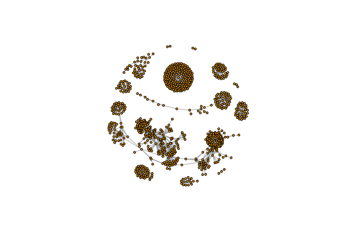

lecture17
================

``` r
install.packages(c("igraph", "RColorBrewer"))
source("http://bioconductor.org/biocLite.R")
biocLite("RCy3")
```

    ## Loading required package: graph

    ## Loading required package: BiocGenerics

    ## Loading required package: parallel

    ## 
    ## Attaching package: 'BiocGenerics'

    ## The following objects are masked from 'package:parallel':
    ## 
    ##     clusterApply, clusterApplyLB, clusterCall, clusterEvalQ,
    ##     clusterExport, clusterMap, parApply, parCapply, parLapply,
    ##     parLapplyLB, parRapply, parSapply, parSapplyLB

    ## The following objects are masked from 'package:stats':
    ## 
    ##     IQR, mad, sd, var, xtabs

    ## The following objects are masked from 'package:base':
    ## 
    ##     anyDuplicated, append, as.data.frame, cbind, colMeans,
    ##     colnames, colSums, do.call, duplicated, eval, evalq, Filter,
    ##     Find, get, grep, grepl, intersect, is.unsorted, lapply,
    ##     lengths, Map, mapply, match, mget, order, paste, pmax,
    ##     pmax.int, pmin, pmin.int, Position, rank, rbind, Reduce,
    ##     rowMeans, rownames, rowSums, sapply, setdiff, sort, table,
    ##     tapply, union, unique, unsplit, which, which.max, which.min

    ## 
    ## Attaching package: 'igraph'

    ## The following objects are masked from 'package:graph':
    ## 
    ##     degree, edges, intersection, union

    ## The following objects are masked from 'package:BiocGenerics':
    ## 
    ##     normalize, union

    ## The following objects are masked from 'package:stats':
    ## 
    ##     decompose, spectrum

    ## The following object is masked from 'package:base':
    ## 
    ##     union

``` r
cwd <-demoSimpleGraph()
```

    ## [1] "type"
    ## [1] "lfc"
    ## [1] "label"
    ## [1] "count"
    ## [1] "edgeType"
    ## [1] "score"
    ## [1] "misc"
    ## Successfully set rule.
    ## Successfully set rule.
    ## Locked node dimensions successfully even if the check box is not ticked.
    ## Locked node dimensions successfully even if the check box is not ticked.
    ## Successfully set rule.
    ## Successfully set rule.

``` r
layoutNetwork(cwd, 'force-directed')

#choose any of the other possible layouts e.g.
possible.layout.names <- getLayoutNames(cwd)

#test the connection to Cytoscape
ping(cwd)
```

    ## [1] "It works!"

``` r
setVisualStyle(cwd, "Marquee")
```

    ## network visual style has been set to "Marquee"

``` r
styles <- getVisualStyleNames(cwd)

setVisualStyle(cwd, styles[13])
```

    ## network visual style has been set to "Nested Network Style"

``` r
prok_vir_cor <-read.delim("virus_prok_cor_abundant.tsv", stringsAsFactors = FALSE)

g <- graph.data.frame(prok_vir_cor,directed = FALSE)

class(g)
```

    ## [1] "igraph"

``` r
plot(g, vertex.size=3, vertex.label=NA)
```



``` r
#to find the vertex labels 
#and to find the edges functions  is E() V(g)
```

``` r
phage_id_affiliation <- read.delim("phage_ids_with_affiliation.tsv")
head(phage_id_affiliation)
```

    ##   first_sheet.Phage_id first_sheet.Phage_id_network phage_affiliation
    ## 1        109DCM_115804                       ph_775              <NA>
    ## 2        109DCM_115804                       ph_775              <NA>
    ## 3        109DCM_115804                       ph_775              <NA>
    ## 4        109DCM_115804                       ph_775              <NA>
    ## 5        109DCM_115804                       ph_775              <NA>
    ## 6        109DCM_115804                       ph_775              <NA>
    ##   Domain DNA_or_RNA Tax_order Tax_subfamily Tax_family Tax_genus
    ## 1   <NA>       <NA>      <NA>          <NA>       <NA>      <NA>
    ## 2   <NA>       <NA>      <NA>          <NA>       <NA>      <NA>
    ## 3   <NA>       <NA>      <NA>          <NA>       <NA>      <NA>
    ## 4   <NA>       <NA>      <NA>          <NA>       <NA>      <NA>
    ## 5   <NA>       <NA>      <NA>          <NA>       <NA>      <NA>
    ## 6   <NA>       <NA>      <NA>          <NA>       <NA>      <NA>
    ##   Tax_species
    ## 1        <NA>
    ## 2        <NA>
    ## 3        <NA>
    ## 4        <NA>
    ## 5        <NA>
    ## 6        <NA>

``` r
bac_id_affi <- read.delim("prok_tax_from_silva.tsv")
head(bac_id_affi)
```

    ##    Accession_ID  Kingdom         Phylum          Class             Order
    ## 1 AACY020068177 Bacteria    Chloroflexi   SAR202 clade marine metagenome
    ## 2 AACY020125842  Archaea  Euryarchaeota Thermoplasmata Thermoplasmatales
    ## 3 AACY020187844  Archaea  Euryarchaeota Thermoplasmata Thermoplasmatales
    ## 4 AACY020105546 Bacteria Actinobacteria Actinobacteria             PeM15
    ## 5 AACY020281370  Archaea  Euryarchaeota Thermoplasmata Thermoplasmatales
    ## 6 AACY020147130  Archaea  Euryarchaeota Thermoplasmata Thermoplasmatales
    ##              Family             Genus Species
    ## 1              <NA>              <NA>    <NA>
    ## 2   Marine Group II marine metagenome    <NA>
    ## 3   Marine Group II marine metagenome    <NA>
    ## 4 marine metagenome              <NA>    <NA>
    ## 5   Marine Group II marine metagenome    <NA>
    ## 6   Marine Group II marine metagenome    <NA>

``` r
#create our gene network for cytoscape
genenet.nodes <- as.data.frame(vertex.attributes(g))

#not all are classified so create empty columns
genenet.nodes$phage_aff <- rep("not_class", nrow(genenet.nodes))
genenet.nodes$Tax_order <- rep("not_class", nrow(genenet.nodes))
genenet.nodes$Tax_subfamily <- rep("not_class", nrow(genenet.nodes))

for (row in seq_along(1:nrow(genenet.nodes))){
  if (genenet.nodes$name[row] %in% phage_id_affiliation$first_sheet.Phage_id_network){
    id_name <- as.character(genenet.nodes$name[row])
    aff_to_add <- unique(subset(phage_id_affiliation,
                                first_sheet.Phage_id_network == id_name,
                                select = c(phage_affiliation,
                                           Tax_order,
                                           Tax_subfamily)))
    genenet.nodes$phage_aff[row] <- as.character(aff_to_add$phage_affiliation)
    genenet.nodes$Tax_order[row] <- as.character(aff_to_add$Tax_order)
    genenet.nodes$Tax_subfamily[row] <- as.character(aff_to_add$Tax_subfamily)
  }
}
```

``` r
## do the same for proks
genenet.nodes$prok_king <- rep("not_class", nrow(genenet.nodes))
genenet.nodes$prok_tax_phylum <- rep("not_class", nrow(genenet.nodes))
genenet.nodes$prok_tax_class <- rep("not_class", nrow(genenet.nodes))

for (row in seq_along(1:nrow(genenet.nodes))){
  if (genenet.nodes$name[row] %in% bac_id_affi$Accession_ID){
    aff_to_add <- unique(subset(bac_id_affi,
                                Accession_ID == as.character(genenet.nodes$name[row]),
                                select = c(Kingdom,
                                           Phylum,
                                           Class)))
    
    genenet.nodes$prok_king[row] <- as.character(aff_to_add$Kingdom)
    genenet.nodes$prok_tax_phylum[row] <- as.character(aff_to_add$Phylum)
    genenet.nodes$prok_tax_class[row] <- as.character(aff_to_add$Class)
  }
}
```

``` r
genenet.edges <- data.frame(igraph::as_edgelist(g))
names(genenet.edges) <- c("name.1", "name.2")

genenet.edges$Weight <- igraph::edge_attr(g)[[1]]

genenet.edges$name.1 <- as.character(genenet.edges$name.1)
genenet.edges$name.2 <- as.character(genenet.edges$name.2)
genenet.nodes$name <- as.character(genenet.nodes$name)

ug <- cyPlot(genenet.nodes,genenet.edges)
```

``` r
#send network to cytoscape
cy <-CytoscapeConnection()
deleteAllWindows(cy)

cw <- CytoscapeWindow("Tara oceans", graph =ug, overwriteWindow = TRUE)

displayGraph(cw)
```

    ## [1] "phage_aff"
    ## [1] "Tax_order"
    ## [1] "Tax_subfamily"
    ## [1] "prok_king"
    ## [1] "prok_tax_phylum"
    ## [1] "prok_tax_class"
    ## [1] "label"
    ## [1] "Weight"

``` r
layoutNetwork(cw)
fitContent(cw)
```

``` r
#colouring
families_to_colour <- unique(genenet.nodes$prok_tax_phylum)
families_to_colour <- families_to_colour[!families_to_colour %in% "not_class"]
node.colour <- RColorBrewer::brewer.pal(length(families_to_colour), "Set3")

setNodeColorRule(cw,
                 "prok_tax_phylum",
                 families_to_colour,
                 node.colour,
                 "lookup",
                 default.color = "#ffffff")
```

    ## Successfully set rule.

``` r
displayGraph(cw)
```

    ## [1] "phage_aff"
    ## [1] "Tax_order"
    ## [1] "Tax_subfamily"
    ## [1] "prok_king"
    ## [1] "prok_tax_phylum"
    ## [1] "prok_tax_class"
    ## [1] "label"
    ## [1] "Weight"

``` r
layoutNetwork(cw)
fitContent(cw)
```

``` r
shapes_for_nodes <- c("DIAMOND")

phage_names <- grep("ph_",
                    genenet.nodes$name,
                    value = TRUE)
setNodeShapeRule(cw,
                 "label",
                 phage_names,
                 shapes_for_nodes)
```

    ## Successfully set rule.

``` r
displayGraph(cw)
```

    ## [1] "phage_aff"
    ## [1] "Tax_order"
    ## [1] "Tax_subfamily"
    ## [1] "prok_king"
    ## [1] "prok_tax_phylum"
    ## [1] "prok_tax_class"
    ## [1] "label"
    ## [1] "Weight"

``` r
fitContent(cw)
```

``` r
#get new layout names 
getLayoutNames(cw)
```

    ##  [1] "attribute-circle"      "stacked-node-layout"  
    ##  [3] "degree-circle"         "circular"             
    ##  [5] "attributes-layout"     "kamada-kawai"         
    ##  [7] "force-directed"        "cose"                 
    ##  [9] "grid"                  "hierarchical"         
    ## [11] "fruchterman-rheingold" "isom"                 
    ## [13] "force-directed-cl"

``` r
getLayoutPropertyNames(cw, layout.name = "force-directed")
```

    ## [1] "numIterations"            "defaultSpringCoefficient"
    ## [3] "defaultSpringLength"      "defaultNodeMass"         
    ## [5] "isDeterministic"          "singlePartition"

``` r
getLayoutPropertyValue(cw, "force-directed", "defaultSpringLength")
```

    ## [1] 20

``` r
getLayoutPropertyValue(cw, "force-directed", "numIterations")
```

    ## [1] 200

``` r
#once we decide on the properties we want
setLayoutProperties(cw, layout.name = "force-directed", list(defaultSpringLength=20, "numIterations"=200))
```

    ## Successfully updated the property 'defaultSpringLength'.
    ## Successfully updated the property 'numIterations'.

``` r
layoutNetwork(cw, layout.name = "force-directed")
fitContent(cw)
```

``` r
## initiate a new node attribute
ug2 <- initNodeAttribute(graph = ug,
                          "degree",
                          "numeric",
                          0.0) 

## degree from graph package for undirected graphs not working well,
## so instead using igraph to calculate this from the original graph
nodeData(ug2, nodes(ug2), "degree") <- igraph::degree(g)

cw2 <- CytoscapeWindow("Tara oceans with degree",
                      graph = ug2,
                      overwriteWindow = TRUE)
displayGraph(cw2)
```

    ## [1] "phage_aff"
    ## [1] "Tax_order"
    ## [1] "Tax_subfamily"
    ## [1] "prok_king"
    ## [1] "prok_tax_phylum"
    ## [1] "prok_tax_class"
    ## [1] "degree"
    ## [1] "label"
    ## [1] "Weight"

``` r
layoutNetwork(cw2)
```

``` r
degree_control_points <- c(min(igraph::degree(g)),
                           mean(igraph::degree(g)),
                           max(igraph::degree(g)))
node_sizes <- c(20,
                20,
                80,
                100,
                110) # number of control points in interpolation mode,
                     # the first and the last are for sizes "below" and "above" the attribute seen.

setNodeSizeRule(cw2,
                "degree",
                degree_control_points,
                node_sizes,
                mode = "interpolate")
```

    ## Locked node dimensions successfully even if the check box is not ticked.
    ## Locked node dimensions successfully even if the check box is not ticked.
    ## Successfully set rule.

``` r
## Locked node dimensions successfully even if the check box is not ticked.
## Locked node dimensions successfully even if the check box is not ticked.
## Successfully set rule.
layoutNetwork(cw2,
              "force-directed")
```

``` r
# Selects the node named "GQ377772"
selectNodes(cw2, "GQ377772") 
getSelectedNodes(cw2)
```

    ## [1] "GQ377772"

``` r
selectFirstNeighborsOfSelectedNodes(cw2)
getSelectedNodes(cw2)
```

    ##  [1] "ph_1392"  "ph_1808"  "ph_3901"  "ph_407"   "ph_4377"  "ph_553"  
    ##  [7] "ph_765"   "ph_7661"  "GQ377772" "ph_3164"

``` r
selectFirstNeighborsOfSelectedNodes(cw2)
getSelectedNodes(cw2)
```

    ##  [1] "ph_1392"       "ph_1808"       "ph_3901"       "ph_407"       
    ##  [5] "ph_4377"       "ph_553"        "ph_765"        "ph_7661"      
    ##  [9] "AACY020207233" "AY663941"      "AY663999"      "AY664000"     
    ## [13] "AY664012"      "EF574484"      "EU802893"      "GQ377772"     
    ## [17] "GU061586"      "GU119298"      "GU941055"      "ph_3164"

``` r
newnet <- createWindowFromSelection(cw2,
                                    "subnet",
                                    "TRUE")
```

    ## [1] sending node attribute "phage_aff"
    ## [1] sending node attribute "Tax_order"
    ## [1] sending node attribute "Tax_subfamily"
    ## [1] sending node attribute "prok_king"
    ## [1] sending node attribute "prok_tax_phylum"
    ## [1] sending node attribute "prok_tax_class"
    ## [1] sending node attribute "degree"
    ## [1] sending node attribute "label"
    ## [1] sending edge attribute "Weight"

``` r
layoutNetwork(newnet, "force-directed")
```
